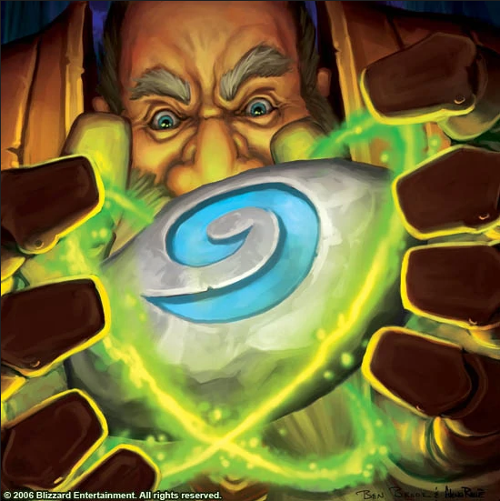

Hearthstone README
===

> 
Hearthstone is a Spigot plugin that recreates the well-known functionality from World of Warcraft. 
> The players sets a desired location as a home and with the use of
> Hearthstone, he can warp back. 
> Hearthstone features customizable cast times and cooldowns to fit your server needs.
 

### Example:

> #### Obtaining a hearthstone.

> #### Setting a home and teleporting to it.

## Usage:

### Item:
> *Right Click* with a Hearthstone to trigger a teleportation.

#### Commands:
- /hearthstone:get - gives the player a hearthstone, 1 per player 
- /hearthstone:sethome - sets a location as the player's home 
- /hearthstone:reload - reloads the plugin configuration 

#### Permissions:
- hearthstone.get - permission to get a hearthstone
- hearthstone.sethome - permission to set up a new home
- hearthstone.reload - permission to reload plugin config (admin only)

## Planned Features:
- ✔️ Particles for casting & successful warp.
- Casting bar to indicate hearthstone progress.
- Ability for OPs to skip cast-time & cooldown.
- Customizable animations for default & op players.
